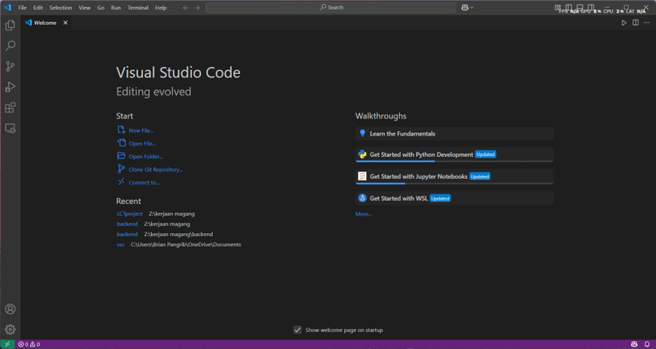

# LCT PROJECT
## Tahap-tahap untuk menjalankan program

**Unduh Visual Studio Code:**

   Silakan unduh Visual Studio Code dari tautan resmi berikut:  
   [https://code.visualstudio.com/](https://code.visualstudio.com/)

**Instalasi:**

   Jalankan file installer yang telah diunduh, lalu ikuti langkah-langkah instalasi standar hingga proses selesai. Jika instalasi berhasil, ikon Visual Studio Code akan muncul di desktop.

**Panduan Lengkap (Opsional):**

   Untuk penjelasan lebih mendalam mengenai proses instalasi, Anda dapat menonton video tutorial berikut:  
   [Cara Instal Visual Studio Code - YouTube](https://www.youtube.com/watch?v=cu_ykIfBprI&ab_channel=ProgrammingKnowledge)

**Membuka Visual Studio Code:**

   Setelah instalasi selesai, buka aplikasi Visual Studio Code. Jika berhasil, tampilan awalnya akan serupa dengan gambar berikut:  
   **

## Pengaturan Visual Studio Code

Setelah berhasil membuka Visual Studio Code, langkah selanjutnya adalah memasang beberapa ekstensi yang dibutuhkan agar proyek dapat dijalankan dengan baik.

### Langkah-langkah:

1. Buka tab **Extensions** di sisi kiri (ikon kotak empat).
2. Cari dan instal ekstensi-ekstensi berikut:

   - **Python**  
     Ekstensi utama untuk menulis dan menjalankan kode Python.

   - **Python Debugger**  
     Digunakan untuk melakukan debugging pada program Python.

   - **Code Runner**  
     Mempermudah menjalankan cuplikan kode berbagai bahasa, termasuk Python.

3. Setelah semua ekstensi terinstal, Visual Studio Code siap digunakan untuk proyek ini.


## Mengunduh Proyek dari GitHub

Setelah Visual Studio Code dan semua ekstensi berhasil diinstal, langkah berikutnya adalah membuka proyek dari GitHub.

### Langkah-langkah:

1. Kunjungi repositori proyek di GitHub berikut ini:  
   [https://github.com/BrianPangrib/LCTproject](https://github.com/BrianPangrib/LCTproject)

2. Klik tombol **Code**, lalu pilih opsi **Download ZIP**.

3. Ekstrak file ZIP ke folder pilihan Anda. Pastikan direktori anda sesuai karena akan ada perubahan pada code.

4. Buka folder hasil ekstrak menggunakan Visual Studio Code:
   - Klik **File** > **Open Folder...**
   - Arahkan ke folder proyek LCT dan klik **Open**.


## Setup Awal di Visual Studio Code untuk menjalankan code

Untuk menjalankan berbagai perintah setup seperti aktivasi virtual environment atau menginstal dependensi, kamu perlu membuka terminal terlebih dahulu.

### Cara Membuka Terminal:

1. Buka Visual Studio Code.
2. Klik menu **Terminal** di bagian atas.
3. Pilih **New Terminal** (atau tekan shortcut `Ctrl + Shift + ~`).
4. Secara default, terminal akan terbuka dalam mode **PowerShell** (untuk pengguna Windows).

Jika terminal tidak otomatis menggunakan PowerShell:
- Klik dropdown kecil di pojok kanan atas terminal.
- Pilih **Select Default Profile** > **PowerShell**.

Setelah terminal terbuka, kamu bisa langsung mengetik perintah seperti:

```powershell
Set-ExecutionPolicy Unrestricted -Scope Process
```

##  Membuat Virtual Environment & Instalasi Library

Setelah terminal PowerShell terbuka dan kebijakan eksekusi diatur, langkah berikutnya adalah membuat virtual environment dan menginstal semua dependensi yang dibutuhkan proyek ini.

### 1. Buat Virtual Environment

Jalankan perintah berikut di terminal:

```powershell
python -m venv venv
.\venv\Scripts\activate
pip install -r requirements.txt
```

##  Menjalankan Script Scraping Data

Setelah semua library berhasil diinstal, langkah berikutnya adalah menjalankan script untuk melakukan scraping data dari masing-masing bank.

Script yang perlu dijalankan adalah:

- `export.py`
- `exportdata.py`
- `exportdatalast.py`

## Sebelum menjalankan perintah pastikan code direktori excel yang akan kalian tuju sudah sesuai

Sebelum menjalankan script scraping, pastikan bahwa **path direktori untuk menyimpan file Excel sudah disesuaikan** dengan lokasi di komputer kalian.

Contoh baris kode di dalam file `export.py`:

```python
# Path untuk file Excel Mandiri
MANDIRI_EXCEL_PATH = r"Z:\kerjaan magang\LCT_MANDIRI.xlsx"
MANDIRI_EXCEL_PATH = r"C:\Users\NamaUser\Documents\LCT_MANDIRI.xlsx"
```
###  Jalankan perintah berikut di terminal dan pastikan direktori code kalian sudah sesuai:

```powershell
python -u "Z:\kerjaan magang\LCTproject\export.py"
python -u "Z:\kerjaan magang\LCTproject\exportdata.py"
python -u "Z:\kerjaan magang\LCTproject\exportdatalast.py"
```

## Menjalankan app.py (flask) untuk menampilkan pada localhost
Sebelum menjalankan script flask, pastikan bahwa command sudah sesuai dengan lokasi file code anda. Setelah sesuai maka jalankan file.

```powershell
python -u "z:\kerjaan magang\LCTproject\app.py"
```
jika berhasil maka akan muncul seperti ini

)

## Setelah menjalankan program buka lokalhost (http://localhost:5000/) pada chrome atau sejenisnya
Jika berhasil maka tampilannya jadi seperti ini:

)

## Untuk memberhentikan flask dan local host
Cara memberhentikan flask pada app.py adalah dengan cara kembali ke terminal dan menekan `ctrl+c`

Setelah itu matikan virtual environtment dengan menggunakan command

```powershell
deactivate
```

###  Program sudah selesai